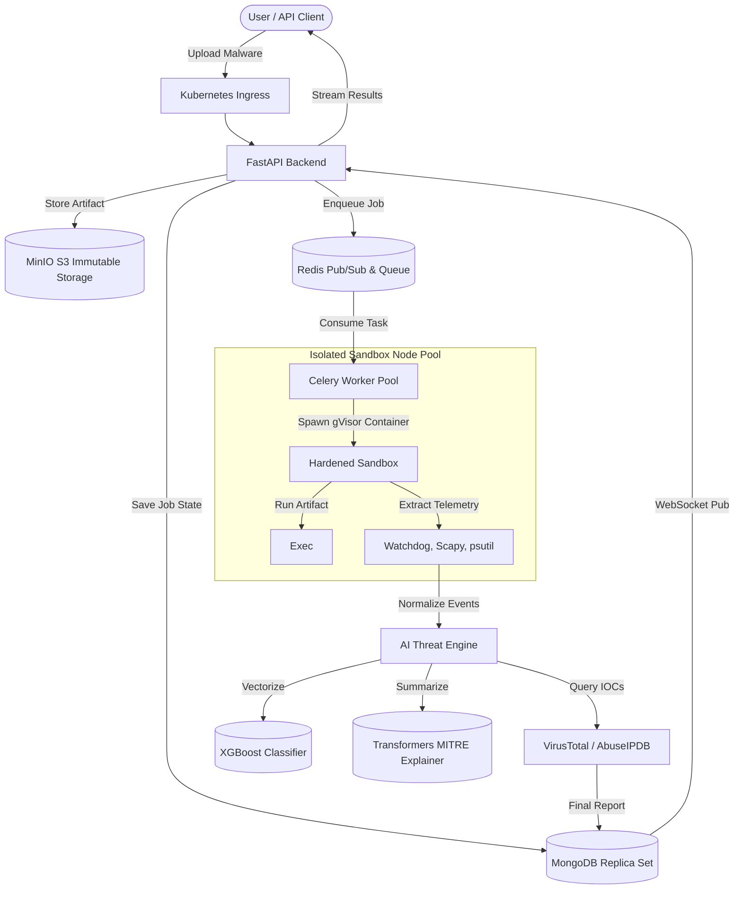
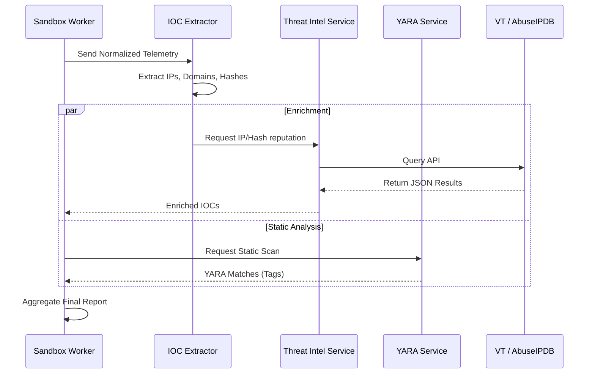

# Sentinel-AI Architecture

## 1. High-Level Architecture Overview

Sentinel-AI is a distributed, cloud-native malware analysis and behavioral intelligence platform. It utilizes an event-driven architecture with isolated execution sandboxes, real-time telemetry extraction, and machine learning-based threat classification.

## 2. Threat Intelligence Pipeline

## 3. Kubernetes & Security Architecture

The platform runs on Kubernetes, strictly isolated using Pod Security Standards and Network Policies.

- **Frontend/Backend Namespaces**: `sentinel-backend`, `sentinel-storage`
- **Isolated Worker Namespace**: `sentinel-workers`
  - Runs on dedicated, tainted node pools (`workload-type=isolated-sandbox`).
  - NetworkPolicies drop ALL egress traffic except specific internal IPs (Redis, MinIO).
  - Pod Security contexts enforce `readOnlyRootFilesystem`, `runAsNonRoot`, and `cap_drop: ALL`.
  - Nested container runtime utilizes `gVisor` (`runsc`) via Docker/containerd for deep kernel isolation.

## 4. Observability

- **Metrics**: `prometheus-fastapi-instrumentator` exposes `/metrics` for Prometheus scraping.
- **Logging**: `structlog` emits JSON structured logs.
- **Tracing**: OpenTelemetry auto-instrumentation injects `trace_id` for request correlation across the distributed system.
