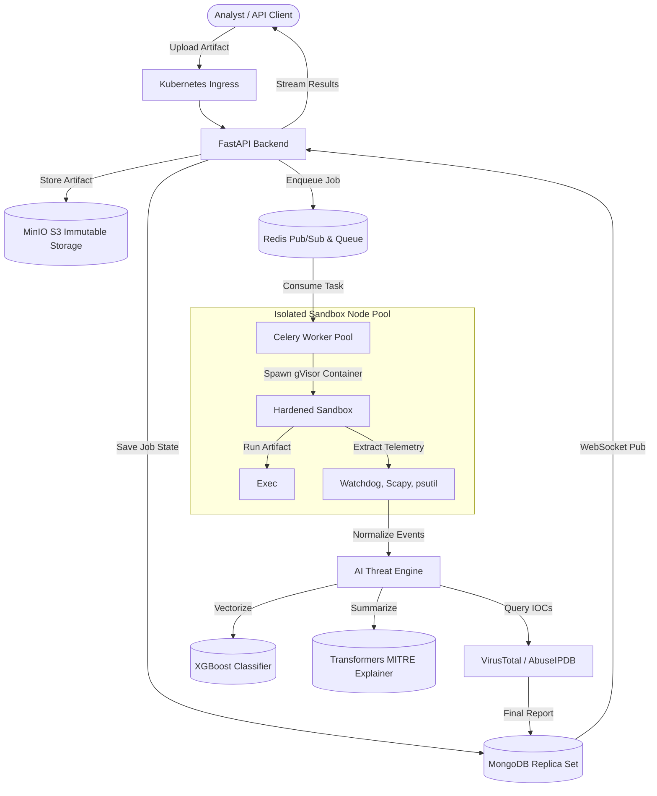
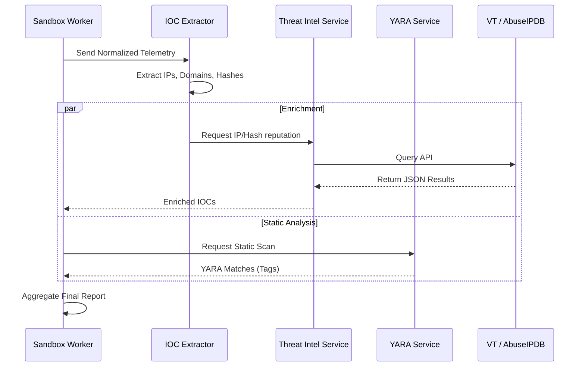

# System Architecture Overview

Aegis-AI is a distributed, cloud-native malware analysis and behavioral intelligence platform. It employs an event-driven architecture with isolated execution sandboxes, real-time telemetry extraction, and intelligence-driven threat classification.

---

## 1. High-Level Component Map

---

## 2. Backend Architecture (`backend/app/`)

The backend is a Python FastAPI application structured into the following packages:

### `app/main.py`
The FastAPI application entrypoint. Registers all routers, middleware (CORS, rate limiting, authentication), exception handlers, and startup/shutdown lifecycle hooks for database connections and OpenTelemetry instrumentation.

### `app/api/`
FastAPI route definitions. Handles HTTP request parsing, authentication guards, and delegates business logic to services.

| Endpoint | Method | Description |
|---|---|---|
| `/upload` | `POST` | Accepts multipart file uploads, hashes the artifact, creates a MongoDB job, triggers the pipeline |
| `/analysis/{job_id}` | `GET` | Returns the completed analysis report for a given job ID |
| `/analysis/latest` | `GET` | Shortcut to the most recently submitted analysis |
| `/ws/jobs/{job_id}/telemetry` | `WebSocket` | Streams real-time sandbox telemetry events to connected clients |

### `app/services/`
Core business logic services. Each service is a focused, single-responsibility module:

| Module | Responsibility |
|---|---|
| `report_generator.py` | **Pipeline Orchestrator** — coordinates the entire analysis lifecycle from upload to final report |
| `static_analysis/hash_analyzer.py` | Computes SHA-256, MD5, file size, and Shannon entropy |
| `static_analysis/python_analyzer.py` | Walks the Python AST to detect `eval()`, `exec()`, `subprocess`, `base64`, `socket`, etc. |
| `static_analysis/pe_analyzer.py` | Parses PE headers, imports, sections, and detects packing/obfuscation |
| `static_analysis/string_extractor.py` | Extracts printable strings and filters out benign file paths |
| `sandbox/orchestrator.py` | Manages sandbox lifecycle state machine (CREATED → RUNNING → COMPLETED) |
| `ioc_pipeline.py` | Consolidates static strings and runtime events into typed IOC records |
| `mitre_mapper.py` | Deterministic mapping of observed telemetry to MITRE ATT&CK techniques |
| `yara_service.py` | Scans uploaded artifacts against compiled YARA rules |
| `graph_ingester.py` | Writes analysis artifacts to Neo4j as a directed attack graph |
| `threat_correlation.py` | Builds chronological attack timelines from telemetry events |
| `ai_correlator.py` | Generates evidence-grounded natural language analysis summaries |
| `intel_enricher.py` | Enriches IOCs against VirusTotal and AbuseIPDB APIs |
| `hunting_service.py` | Provides query-based threat hunting across historical analysis data |
| `siem_exporter.py` | Formats and exports structured events for SIEM integration |
| `kubernetes_job_manager.py` | Manages Kubernetes Job resources for enterprise sandbox orchestration |

### `app/analysis/` — The Intelligence Layer
The modular analysis pipeline that converts raw telemetry into actionable threat intelligence. See [Intelligence Layer](intelligence_layer.md) for complete documentation.

| Module | Responsibility |
|---|---|
| `models.py` | Pydantic data models (`Capability`, `BehaviorChain`, `ThreatClassification`, `ImpactAssessment`, `RiskAssessment`, `AnalystReport`) |
| `capability_engine.py` | Extracts attacker capabilities from static findings and runtime telemetry |
| `behavior_engine.py` | Correlates capabilities into behavioral attack chains |
| `threat_classifier.py` | Classifies payloads into malware families based on observed capabilities and chains |
| `impact_engine.py` | Calculates Confidentiality, Integrity, and Availability impact |
| `risk_engine.py` | Computes weighted risk score across 5 pillars |
| `report_generator.py` | Compiles the structured `AnalystReport` with executive summary and recommendations |

### `app/core/`
Cross-cutting infrastructure concerns:

| Module | Responsibility |
|---|---|
| `config.py` | Application configuration loaded from environment variables via Pydantic `BaseSettings` |
| `security.py` | JWT authentication, API key validation, and RBAC guards |
| `metrics.py` | Prometheus counters (`jobs_processed_total`, `malware_detected_total`) |
| `logger.py` | Structured JSON logging via `structlog` |
| `limiter.py` | Rate limiting configuration via `slowapi` |
| `exceptions.py` | Custom exception classes and global error handlers |

### `app/models/`
MongoDB document models and database interaction layer. Uses Motor (async MongoDB driver).

### `app/database/`
Database connection management for MongoDB, Redis, and Neo4j.

---

## 3. Frontend Architecture (`frontend/src/`)

The frontend is a React 18 + TypeScript single-page application built with Vite and React Router.

### Pages

| Page | Description |
|---|---|
| `Dashboard.tsx` | Primary SOC dashboard — displays recent analyses, risk distribution charts, and quick-upload |
| `AnalysisDetail.tsx` | Deep-dive analysis view — tabbed interface showing telemetry, IOCs, MITRE mappings, risk breakdown, and AI summary |
| `Workspace.tsx` | File upload and job management workspace |
| `AttackDashboard.tsx` | Neo4j-powered attack graph visualization |
| `Observability.tsx` | Platform health metrics, trace explorer, and system performance monitoring |
| `Login.tsx` | Authentication page with JWT token management |

### Key Components

| Directory | Description |
|---|---|
| `components/dashboard/` | Dashboard-specific widgets (charts, stats cards, recent analysis list) |
| `components/hunting/` | Threat hunting query builder and results display |
| `components/threat/` | Threat intelligence visualization components |
| `components/ui/` | Reusable design system components |
| `hooks/` | Custom React hooks (WebSocket management, API data fetching) |
| `api/` | Typed API client for communicating with the FastAPI backend |

---

## 4. Data Stores

### MongoDB
Primary persistent store for all job metadata, analysis results, and reports. The `sandbox_jobs` collection stores the complete lifecycle of each analysis job including:
- Upload metadata (filename, hashes, size, entropy)
- Static analysis results
- Full telemetry event array
- Extracted IOCs
- MITRE ATT&CK mappings
- Intelligence Layer output (capabilities, chains, threat classification, risk assessment)
- YARA matches
- Attack timeline
- AI-generated summary

### Redis
Serves two critical roles:
1. **PubSub Bus**: Real-time telemetry streaming from sandbox workers to the WebSocket endpoint via `job_updates:{job_id}` channels.
2. **Caching Layer**: Caches frequently accessed analysis results and threat intelligence lookups.

### Neo4j
Graph database storing the attack graph representation. Nodes include `SandboxJob`, `File`, `Process`, `NetworkConnection`, `DnsQuery`, `IOC`, `MitreTechnique`, and `YaraRule`. Edges represent causal relationships (e.g., `SPAWNED`, `CONNECTED_TO`, `RESOLVED`, `MAPPED_TO`).

---

## 5. Threat Intelligence Pipeline

---

## 6. Kubernetes & Security Architecture

The platform runs on Kubernetes, strictly isolated using Pod Security Standards and Network Policies.

- **Frontend/Backend Namespaces**: `aegis-backend`, `aegis-storage`
- **Isolated Worker Namespace**: `aegis-workers`
  - Runs on dedicated, tainted node pools (`workload-type=isolated-sandbox`).
  - NetworkPolicies drop ALL egress traffic except specific internal IPs (Redis, MinIO).
  - Pod Security contexts enforce `readOnlyRootFilesystem`, `runAsNonRoot`, and `cap_drop: ALL`.
  - Nested container runtime utilizes `gVisor` (`runsc`) via Docker/containerd for deep kernel isolation.

---

## 7. Observability Stack

| Pillar | Implementation |
|---|---|
| **Metrics** | `prometheus-fastapi-instrumentator` exposes `/metrics` for Prometheus. Custom counters track `jobs_processed_total` and `malware_detected_total`. |
| **Logging** | `structlog` emits JSON structured logs with correlation IDs. |
| **Tracing** | OpenTelemetry auto-instrumentation injects `trace_id` and creates spans for each pipeline stage (`static_analysis`, `sandbox_execution`, `correlation_analysis`, `graph_ingestion`, `timeline_generation`, `finalize_report`). |
