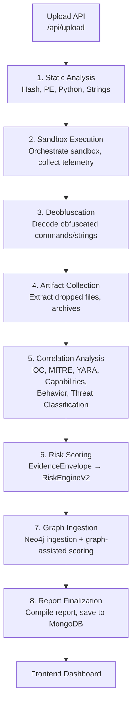
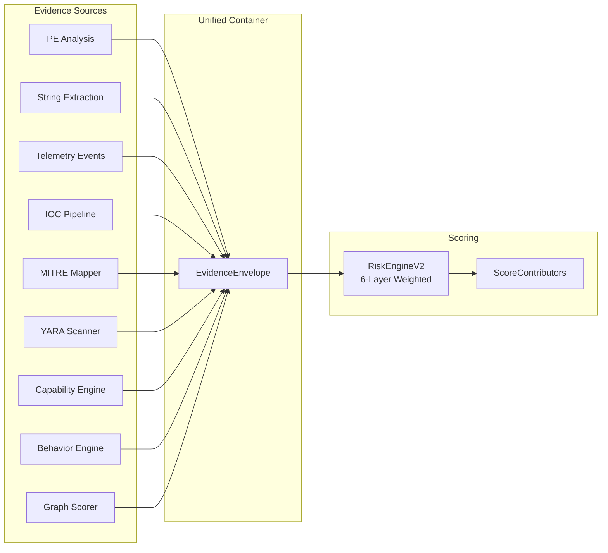

# ACROS — Analysis Pipeline Execution Flow

## Overview

Every uploaded malware sample passes through the following pipeline of composable stages. Each stage reads from and writes to a shared `PipelineContext` object.

## Pipeline Architecture

## Stage Details

### 1. Static Analysis (`StaticAnalysisStage`)
- **Input**: `context.local_path`, `context.filename`
- **Output**: `context.static_results` (hash, PE, Python, strings)
- Runs hash analysis, string extraction, and format-specific analysis (PE or Python)

### 2. Sandbox Execution (`SandboxExecutionStage`)
- **Input**: `context.job_id`, `context.local_path`
- **Output**: `context.telemetry_events`
- Orchestrates the sandbox (mock/firecracker) and collects runtime telemetry events

### 3. Deobfuscation (`DeobfuscationStage`)
- **Input**: `context.telemetry_events`, `context.static_results`
- **Output**: `context.deobfuscation_report`, modified events with decoded fields
- Strips encoding layers (base64, hex, URL-encoding, PowerShell)

### 4. Artifact Collection (`ArtifactCollectionStage`)
- **Input**: `context.telemetry_events`, workspace directory
- **Output**: `context.artifact_report`
- Extracts dropped files, classifies artifacts, expands archives recursively

### 5. Correlation Analysis (`CorrelationStage`)
- **Input**: `context.static_results`, `context.telemetry_events`
- **Output**: `context.iocs`, `context.mitre_mappings`, `context.yara_matches`, `context.capabilities`, `context.behavior_chains`, `context.threat`, `context.impact`
- Combines six sub-engines: IOC pipeline, MITRE mapper, YARA scanner, Capability engine, Behavior engine, Threat classifier

### 6. Risk Scoring (`RiskScoringStage`)
- **Input**: All correlation outputs
- **Output**: `context.envelope`, `context.risk_assessment`
- Builds the `EvidenceEnvelope`, runs `RiskEngineV2` (6-layer weighted scoring), propagates child artifact risk

### 7. Graph Ingestion (`GraphIngestionStage`)
- **Input**: All telemetry, IOCs, MITRE, YARA, artifacts
- **Output**: Updated `context.risk_assessment` (with graph bonus), `context.attack_timeline`
- Ingests everything into Neo4j, runs graph-assisted correlation scoring, re-scores if graph bonus applies

### 8. Report Finalization (`ReportFinalizationStage`)
- **Input**: All context data
- **Output**: `context.report`, saved to MongoDB
- Generates the analyst report, persists to MongoDB, emits metrics, broadcasts completion

## Data Flow Diagram

## Key Design Principles

1. **Single Evidence Container**: All evidence flows through `EvidenceEnvelope` — no evidence source is accidentally ignored
2. **Composable Stages**: Each stage implements `PipelineStage` ABC — can be added, removed, or reordered
3. **Non-Fatal Failures**: Each stage catches exceptions internally — a Neo4j outage won't crash the analysis
4. **Graph as Evidence Provider**: The graph scorer produces `GraphEvidence` that feeds back into the envelope, not a side-channel score
5. **Explainable Scoring**: Every point in the final score traces to a `ScoreContributor` with source, reason, and points
