# ACROS — Module Dependency Graph

## Backend Module Map

```mermaid
graph TD
    subgraph API Layer
        MAIN["main.py"]
        UPLOAD["routes/upload.py"]
        AUTH_R["routes/auth.py"]
        DASH["routes/dashboard.py"]
        GRAPH_R["routes/graph.py"]
    end

    subgraph Pipeline Layer
        FACTORY["pipeline/factory.py"]
        REGISTRY["pipeline/registry.py"]
        STAGE["pipeline/stage.py"]
        CONTEXT["pipeline/context.py"]
    end

    subgraph Pipeline Stages
        S_STATIC["stages/static_analysis.py"]
        S_SANDBOX["stages/sandbox_execution.py"]
        S_DEOBF["stages/deobfuscation.py"]
        S_ARTIFACT["stages/artifact_collection.py"]
        S_CORR["stages/correlation.py"]
        S_RISK["stages/risk_scoring.py"]
        S_GRAPH["stages/graph_ingestion.py"]
        S_REPORT["stages/report_finalization.py"]
    end

    subgraph Analysis Layer
        ENVELOPE["evidence_envelope.py"]
        RISK_V2["risk_engine_v2.py"]
        MODELS["models.py"]
        CAP_ENG["capability_engine.py"]
        BEH_ENG["behavior_engine.py"]
        THREAT["threat_classifier.py"]
        IMPACT["impact_engine.py"]
        ANALYST["analyst_report.py"]
        DEOBF["deobfuscation.py"]
        ARTIFACT["artifact_engine.py"]
        GRAPH_S["graph_scorer.py"]
        YARA_S["yara_scorer.py"]
        IOC_S["ioc_scorer.py"]
        MITRE_S["mitre_severity.py"]
    end

    subgraph Services Layer
        IOC_P["ioc_pipeline.py"]
        MITRE_M["mitre_mapper.py"]
        YARA_SVC["yara_service.py"]
        GRAPH_I["graph_ingester.py"]
        THREAT_C["threat_correlation.py"]
        ORCH["sandbox/orchestrator.py"]
        MOCK["sandbox/mock_sandbox.py"]
    end

    subgraph Core Layer
        CONFIG["core/config.py"]
        SECURITY["core/security.py"]
        LOGGER["core/logger.py"]
        AUTH_REPO["core/auth_repository.py"]
        AUTH_MONGO["core/auth_repository_mongo.py"]
        AUTH_SQLITE["core/auth_repository_sqlite.py"]
    end

    subgraph Database Layer
        MONGO["database/mongodb.py"]
        NEO4J["database/neo4j.py"]
        REDIS["database/redis.py"]
    end

    %% API → Pipeline
    UPLOAD --> FACTORY
    FACTORY --> REGISTRY
    REGISTRY --> STAGE

    %% Stages → Analysis
    S_STATIC --> CAP_ENG
    S_CORR --> IOC_P
    S_CORR --> MITRE_M
    S_CORR --> YARA_SVC
    S_CORR --> CAP_ENG
    S_CORR --> BEH_ENG
    S_CORR --> THREAT
    S_CORR --> IMPACT
    S_RISK --> ENVELOPE
    S_RISK --> RISK_V2
    S_GRAPH --> GRAPH_I
    S_GRAPH --> GRAPH_S
    S_REPORT --> ANALYST

    %% Analysis dependencies
    RISK_V2 --> ENVELOPE
    RISK_V2 --> MODELS
    RISK_V2 --> YARA_S
    RISK_V2 --> IOC_S
    RISK_V2 --> MITRE_S
    ENVELOPE --> MODELS
    BEH_ENG --> MODELS
    THREAT --> MODELS
    IMPACT --> MODELS
    ANALYST --> MODELS

    %% Core dependencies
    MONGO --> CONFIG
    NEO4J --> CONFIG
    SECURITY --> CONFIG
    AUTH_MONGO --> AUTH_REPO
    AUTH_SQLITE --> AUTH_REPO
    AUTH_MONGO --> MONGO

    %% Graph
    GRAPH_I --> NEO4J
    GRAPH_S --> NEO4J
```

## Key Dependency Rules

| Rule | Description |
|---|---|
| **Analysis → Models only** | Analysis modules import from `models.py`, never from API or Services |
| **Services → Analysis** | Services orchestrate analysis modules, not the reverse |
| **Stages → Services + Analysis** | Pipeline stages can import both services and analysis modules |
| **Core → nothing** | Core modules (config, security, logger) have no internal dependencies |
| **Database → Core** | Database modules only import from core (config) |
| **No circular imports** | The dependency graph is a DAG — no cycles |

## Module Counts

| Layer | Files | Purpose |
|---|---|---|
| API | 12 routes | HTTP endpoints |
| Pipeline | 4 framework + 7 stages | Composable analysis pipeline |
| Analysis | 14 modules | Scoring, classification, evidence |
| Services | 7 modules | External integrations, orchestration |
| Core | 6 modules | Config, auth, security, logging |
| Database | 3 modules | MongoDB, Neo4j, Redis connections |
